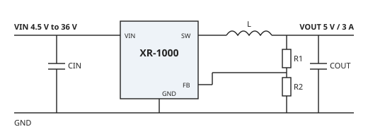

<!-- TODO: TEMPLATE CONTENT. The XR-1000 is a fictional part and every value
in this file is a placeholder. Replace them with your part's measured and
guaranteed data, then change the watermark above. -->

# Features

:::: {layout-ncol=2}

::: {}
- 4.5 V to 36 V input voltage range
- 3 A continuous output current
- 85 mΩ / 45 mΩ integrated MOSFETs
- 45 µA quiescent current
:::

::: {}
- 500 kHz fixed switching frequency
- ±1.5 % feedback accuracy over temperature
- Cycle-by-cycle current limit, thermal shutdown
- SOT-23-6 package
:::

::::

# Applications

- Industrial 12 V and 24 V bus supplies
- Point-of-load regulation for FPGAs and microcontrollers
- Battery-powered test equipment

# Description

The XR-1000 is a synchronous step-down (buck) converter that delivers up to
3 A from a 4.5 V to 36 V input. Integrated high-side and low-side MOSFETs
keep the external parts count to an inductor, two capacitors, and a
feedback divider (@fig-typ-app). Light-load efficiency stays high because
the device skips pulses below about 200 mA (@fig-efficiency).

{#fig-typ-app width=85% fig-alt="Schematic: VIN with input capacitor feeds the XR-1000; its SW pin drives an inductor to VOUT with an output capacitor; a resistor divider from VOUT sets the FB pin."}

# Pin Configuration and Functions

| Pin | Name | Type | Description |
|:---:|:-----|:----:|:------------|
| 1 | BST | I | Bootstrap. Connect 100 nF from BST to SW. |
| 2 | GND | G | Ground. |
| 3 | FB | I | Feedback input. Connect to the output divider (@eq-vout). |
| 4 | EN | I | Enable. High turns the converter on; internal 1 MΩ pull-down. |
| 5 | VIN | P | Supply input. Bypass with 10 µF to GND close to the pin. |
| 6 | SW | O | Switch node. Connect to the inductor. |

: Pin functions (I = input, O = output, P = power, G = ground) {#tbl-pins}

# Specifications

## Absolute Maximum Ratings

| Parameter | Min | Max | Unit |
|:----------|----:|----:|:----:|
| VIN to GND | −0.3 | 40 | V |
| SW to GND | −1 | 40 | V |
| BST to SW | −0.3 | 6 | V |
| EN, FB to GND | −0.3 | 6 | V |
| Junction temperature, T~J~ | −40 | 150 | °C |
| Storage temperature | −65 | 150 | °C |

: Absolute maximum ratings. Stresses beyond these may cause permanent damage. {#tbl-abs-max}

## Electrical Characteristics

V~IN~ = 12 V, T~A~ = 25 °C, unless otherwise noted.

| Parameter | Symbol | Conditions | Min | Typ | Max | Unit |
|:----------|:------:|:-----------|----:|----:|----:|:----:|
| Input voltage range | V~IN~ | | 4.5 | | 36 | V |
| Undervoltage lockout, rising | V~UVLO~ | | 4.1 | 4.3 | 4.5 | V |
| Quiescent current | I~Q~ | Not switching, V~FB~ = 0.9 V | | 45 | 70 | µA |
| Shutdown current | I~SHDN~ | EN = 0 V | | 1.5 | 4 | µA |
| Feedback voltage | V~FB~ | T~J~ = −40 °C to 125 °C | 0.788 | 0.800 | 0.812 | V |
| Switching frequency | f~SW~ | | 450 | 500 | 550 | kHz |
| High-side on-resistance | R~DS(on)~ | | | 85 | | mΩ |
| Low-side on-resistance | R~DS(on)~ | | | 45 | | mΩ |
| Current limit | I~LIM~ | High-side switch | 3.8 | 4.5 | 5.2 | A |
| Thermal shutdown | T~SD~ | | | 160 | | °C |

: Electrical characteristics {#tbl-ec}

## Typical Characteristics

V~OUT~ = 5 V, L = 4.7 µH, T~A~ = 25 °C. The curves are plotted from
`data/*.csv` by `scripts/make_figures.py` on every build.

::: {layout-ncol=2}
{#fig-efficiency fig-alt="Efficiency versus load current on a log axis for 12 V and 24 V input; efficiency peaks near 93 percent around 1 A."}

{#fig-line-reg fig-alt="Output voltage versus input voltage from 4.5 V to 36 V at 0.1 A and 3 A load; output stays within 5 mV of 5 V."}
:::

# Application Information

## Setting the Output Voltage

A resistor divider from V~OUT~ to FB sets the output (@fig-typ-app):

$$
V_{\mathrm{OUT}} = V_{\mathrm{FB}}\left(1 + \frac{R_1}{R_2}\right)
$$ {#eq-vout}

With V~FB~ = 0.8 V, R~1~ = 52.3 kΩ and R~2~ = 10 kΩ give 4.98 V. Keep R~2~
at 10 kΩ or below so FB leakage does not shift the output.

## Layout Guidelines

1. Place C~IN~ as close as possible to VIN and GND; this loop carries the
   fastest edges on the board.
2. Keep the SW node copper small; it is the main radiated-noise source.
3. Route FB away from SW and the inductor, and connect the bottom of the
   divider directly to the GND pin.

# Ordering Information

| Part number | Package | Temperature range | Packing |
|:------------|:--------|:-----------------:|:--------|
| XR-1000-SOT | SOT-23-6 | −40 °C to 125 °C | Tape and reel, 3000 |
| XR-1000-EVM | Evaluation module | — | Each |

: Ordering information {#tbl-ordering}

# Revision History

| Revision | Date | Changes |
|:--------:|:-----|:--------|
| 0.1 | 2026-09-26 | Initial template. |

: Revision history {#tbl-revisions}
