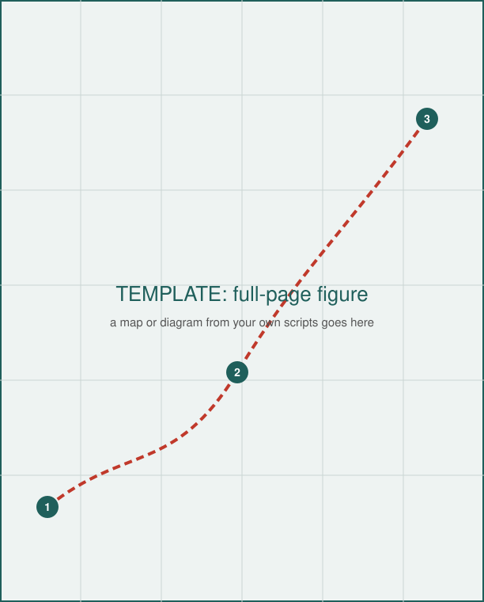

<!-- TODO: TEMPLATE CONTENT. Everything below is placeholder text that
shows how each feature is written. Replace it with the report. -->

::: {.callout-warning}
## Read this first

Put the one thing the reader must not miss at the top: a safety limit, a
deadline, a decision that has to be made from this page. Callouts come in
five kinds: `note`, `tip`, `important`, `warning`, and `caution`.
:::

# The short version

Lead with the answer. This trip is  days for
 people,  miles of driving:
about  in fuel and 
in lodging.

Every number in that paragraph comes from `data/model.json` through
`scripts/make_figures.py`, which writes `_variables.yml`. Change the data,
rebuild, and the prose follows; nothing is typed twice, so the document
can't disagree with the model.

::: {.callout-important}
## Decide by Friday

A box for an action the reader takes from this page: what to book, whom
to call, by when.
:::

# The plan

@tbl-schedule is built from `data/schedule.csv` on every build.



: Day by day {#tbl-schedule}

The long route is  miles. At the slowest walker's
pace that is  hours against
 hours of daylight, so it
****. A derived verdict like that belongs in the
model, not in the prose.

{#fig-elevation fig-alt="Area chart of elevation against distance: the route climbs from 1,200 ft to a high point of 3,350 ft at mile 5, then descends to 1,350 ft at mile 9."}

# What to bring

- Lists work as usual, and so do checklists:
- [ ] water, 2 liters each
- [ ] headlamp, even for a day trip
- [ ] printed copy of this document; phones die

Names keep their marks: Hawaiʻi, Kōkua, Māori, São Paulo, Zürich. For
Japanese or Chinese, name an installed face in the front matter's
`cjk-font:` (README.md, "Readers and page sizes").



# The map

A full page for a map or diagram made by your own scripts. Keep the map
code where it lives; point the report at its output.

{#fig-map height=75% fig-alt="Placeholder map: a dashed red route through three numbered stops on a grid."}



# Sources

Say where each number came from and when it was pulled, so a reader can
check it and you can refresh it:

- Drive times: a routing service, pulled on the build date.
- Daylight: a sunrise and sunset table for the location and date.
